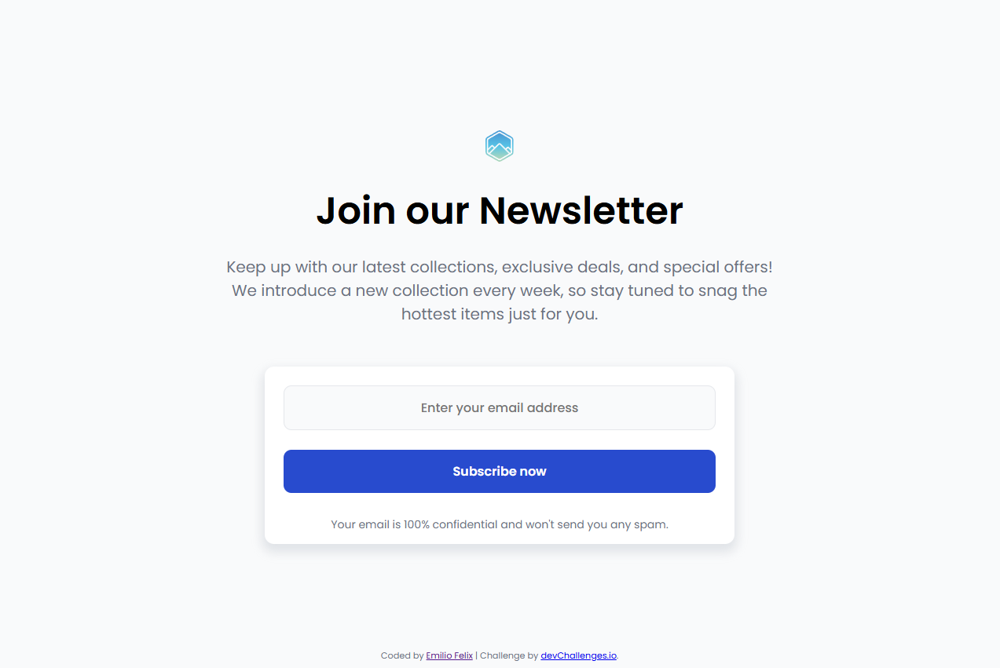

<h1 align="center">Newsletter Sign Up Page | devChallenges</h1>

   Solution for a challenge <a href="https://devchallenges.io/challenge/join-our-newsletter" target="_blank">Join Our Newsletter</a> from <a href="http://devchallenges.io" target="_blank">devChallenges.io</a>.

  <h3>
    <a href="{https://your-demo-link.your-domain}">
      Demo
    </a>
     | 
    <a href="{https://your-url-to-the-solution}">
      Solution
    </a>
     | 
    <a href="https://devchallenges.io/challenge/join-our-newsletter">
      Challenge
    </a>
  </h3>

<!-- TABLE OF CONTENTS -->

## Table of Contents

- [Overview](#overview)
  - [What I learned](#what-i-learned)
  - [Useful resources](#useful-resources)
- [Built with](#built-with)
- [Features](#features)
- [Contact](#contact)
- [Acknowledgements](#acknowledgements)

<!-- OVERVIEW -->

## Overview

A mobile-first, responsive newsletter subscription component. This project marks my transition from a browser-based learning sandbox to a professional local development environment (VS Code). It demonstrates hands-on experience with local project architecture, accurate asset linking, and production-ready deployment preparation.

### What I learned

- **Local Environment Architecture:** Mastered file pathing correctly and managing a local project structure outside of guided tutorials.
- **The CSS Box Model ("Gross vs. Net"):** Learned that `width: 100%` only works as intended when combined with `box-sizing: border-box`, ensuring padding doesn't inflate the element's total footprint.
- **Flexbox Inheritance:** Discovered how flex containers shrink child elements (like `<form>`) to their minimum width, and how to override this behavior for full-width responsiveness.
- **Defensive Mobile UX:** Shifted from "locked centered" layouts (`height: 100vh`) to natural document flow on mobile breakpoints to prevent virtual keyboards from blocking user input fields.

### Built with

- Semantic HTML5 markup
- Vanilla CSS3
- CSS Flexbox

## Features

This application/site was created as a submission to a [DevChallenges](https://devchallenges.io/challenges-dashboard) challenge.

## Author

- Emilio Felix
- GitHub [@emiliofelixdev](https://github.com/emiliofelixdev)
